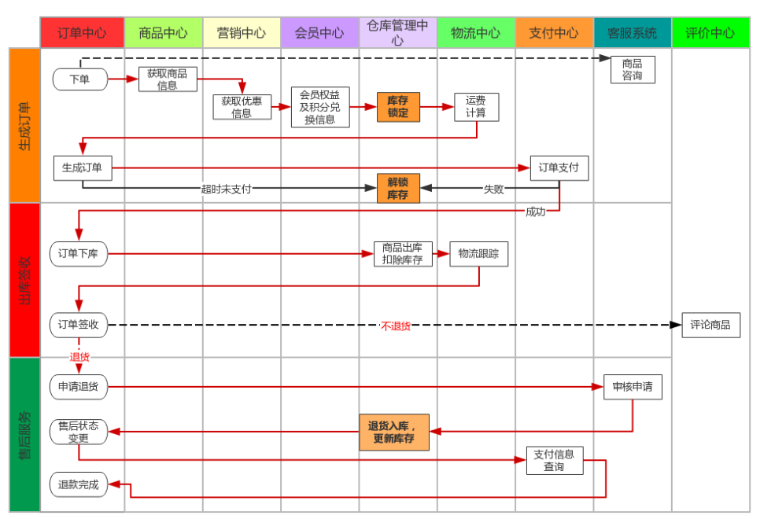
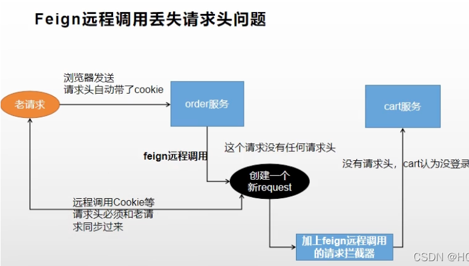
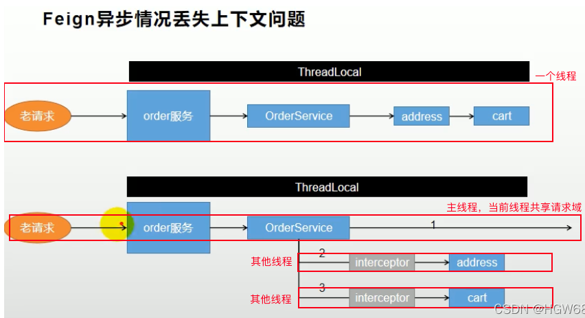

# 一、页面环境搭建
````
1、复制confirm.html、createForWxNative.html、detail.html、list.html、pay.html 到订单服务

2、把 resource/静态资源/html/static/order 复制到 到 /mydata/nginx/html/static

3、修改 C:\Windows\System32\drivers\etc 下的 hosts文件
添加映射
192.168.48.129(虚拟机ip) order.gulimall.com

4、网关配置路由
- id: gulimall_order_route
  uri: lb://gulimall-order
  predicates:
    - Host=order.gulimall.com
    
5、加入注册中心、开启远程调用

6、thymeleaf依赖、关缓存

7、订单服务写 {page}.html接口用来跳转页面

8、测试访问
````
# 二、整合Spring Session
````
1、导入Spring Session、Redis、jedis依赖

2、引导类开启Spring Session

3、配置文件配置redis地址、Spring Session存储方式

4、复制 商品服务的GulimallSessionConfig 到订单服务
````
# 三、整合线程池
````
1、复制商品服务的 线程池配置 到订单服务下

2、yml自定义线程池属性
````
# 四、订单分析
## 1、订单状态
````
1、待付款
用户提交订单后， 订单进行预下单， 目前主流电商网站都会唤起支付， 便于用户快速完成支付， 需要注意的是待付款状态下可以对库存进行锁定， 锁定库存需要配置支付超时时间， 超时后将自动取消订单， 订单变更关闭状态。
2、已付款/待发货
用户完成订单支付， 订单系统需要记录支付时间， 支付流水单号便于对账， 订单下放到 WMS系统， 仓库进行调拨， 配货， 分拣， 出库等操作。
3、待收货/已发货
仓储将商品出库后， 订单进入物流环节， 订单系统需要同步物流信息， 便于用户实时知悉物品物流状态
4、已完成
用户确认收货后， 订单交易完成。 后续支付侧进行结算， 如果订单存在问题进入售后状态
5、已取消
付款之前取消订单。 包括超时未付款或用户商户取消订单都会产生这种订单状态。
6、售后中
用户在付款后申请退款， 或商家发货后用户申请退换货。售后也同样存在各种状态， 当发起售后申请后生成售后订单， 售后订单状态为待审核， 等待商家审核， 商家审核通过后订单状态变更为待退货， 等待用户将商品寄回， 商家收货后订单状态更新为待退款状态， 退款到用户原账户后订单状态更新为售后成功。
````
## 2、订单流程

# 五、订单登录拦截
````
1、订单服务的OrderWebController 编写/toTrade接口 用来跳转页面

2、登录拦截器,HandlerInterceptor 

3、WebMvcConfigurer 配置类添加拦截器
````
# 六、订单确认页
## 1、接口编写
````
1、新建vo 
OrderConfirmVo 订单确认页需要的数据
MemberAddressVo 用户收获地址
OrderItemVo 所有选中的购物项

2、会员模块 写/member/memberreceiveaddress/{memberId}/address 获取会员所有收货地址

3、商品模块 写/product/skuinfo/{skuId}/price 获取指定商品的价格

4、购物车模块 写/currentUserCartItems 
远程调用商品模块 获取指定商品的价格
最终获取用户选择的所有CartItem

5、订单服务写 /toTrade 
远程调用会员模块 获取会员所有收货地址
远程调用购物车模块 获取用户选择的所有CartItem
最后返回订单确认页需要的数据
````
## 2、Feign远程调用丢失请求头问题

````
问题: Feign远程调用的时候会丢失请求头

原因: 远程调用是一个新的请求，不携带之前请求的cookie，导致购物车服务得不到请求头cookie里的登录信息。

解决: 订单服务 配置类添加请求拦截器 GulimallFeignConfig
因为feign在远程调用之前会执行所有的RequestInterceptor拦截器
````
## 3、异步线程丢失主线程请求头问题

````
由于 RequestContextHolder底层使用的是线程共享数据 ThreadLocal<RequestAttributes>，我们知道线程共享数据的域是 当前线程下, 线程之间是不共享的。所以在开启异步后，异步线程获取不到主线程请求的信息，自然也就无法共享cookie了。

解决: 向异步 RequestContextHolder 线程域中放主线程的域。
````
## 4、商品的库存查询
````
1、订单服务 新建SkuStockVo 是否有库存

2、OrderConfirmVo 新增属性 Map<Long, Boolean> stocks

3、在订单确认页数据获取 Service层实现类 OrderServiceImpl 方法中远程调用库存模块批量查询库存
````
## 5、根据用户地址ID，返回详细地址并计算物流费
````
1、复制订单服务下的 MemberAddressVo 到 库存服务

2、库存服务 新建 FareVO

3、库存服务写/ware/wareinfo/fare接口 
远程调用会员服务 查询收货地址
根据用户地址，返回详细地址并计算物流费
````
# 七、保证接口幂等性，防重复提交表单
## 1、幂等性概述
````
1、接口幂等性就是用户对于同一操作发起的一次请求或者多次请求的结果是一致的。

2、接口幂等性
接口幂等性就是用户对于同一操作发起的一次请求或者多次请求的结果是一致的，不会因为多次点击而产生了副作用，比如说支付场景，用户购买了商品支付扣款成功，但是返回结果的时候网络异常，此时钱已经扣了，用户再次点击按钮，此时会进行第二次扣款，返回结果成功，用户查询余额返发现多扣钱了，流水记录也交成了两条这就没有保证接口的幂等性。

3、哪些情况需要防止
    用户多次点击按钮
    用户页面回退再次提交
    微服务互相调用，由于网络问题，导致请求失败。feign 触发重试机制
    其他业务情況
    
4、幂等性解决方案
    1、token机制（令牌机制）本项目采用令牌机制
    2、各种锁机制
    3、各种唯一性约束
    4、防重表
    5、全局请求唯一id
````
## 2、任务幂等性的三种保证方法
````
数据库约束：比如唯一约束，主键。同一个主键不可能两次都插入成功。不推荐因为适用范围太窄，只适用于保存数据库前就已经设置好主键并且每次主键一样的情况下。

乐观锁：数据库表中增加一个版本字段，更新时判断是否等于某个版本。例如重复提交时判断数据库发现版本已被改变就不提交了。不推荐，因为要查数据库，给数据库压力，临时的操作我们尽量在缓存库里操作，降低数据库压力。

Redis唯一序列号（推荐）：Redis键为任务id，值为随机序列化uuid。请求前生成唯一的序列号，携带序列号去请求，请求时在redis记录该序列号表示以该序列号的请求执行过了，如果相同的序列号再次来执行说明是重复执行。也可以通过让用户每次提交时输入验证码，提交后校验前后端验证码实现幂等性。
````
## 3、代码实现，防重复提交表单，唯一序列号方式保证幂等性
````
1、修改 orderService.orderConfirm 确认订单时服务器和浏览器都保存一份防重令牌

2、新建OrderSubmitVo 封装订单提交数据, SubmitOrderResponseVo 封装下订单后返回的数据, 写 /submitOrder接口 下订单时验证令牌
````
# 八、
