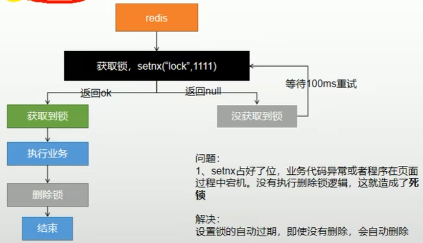

# 一、缓存
## 1、缓存使用
````
为了系统性能的提升, 我们一般都会将部分数据放入缓存中, 加速访问。而db承担数据落盘工作。

哪些数据适合放入缓存:
    即时性、数据一致性要求不高的
    访问量大且更新频率不高的数据(读书, 写少)
    
举例: 电商类应用, 商品分类, 商品列表等适合缓存并加一个失效时间(根据更新频率来定), 后台如果发布一个商品, 买家需要5分钟才能看到新的商品一般还是可以接受的。
````
## 2、读模式缓存使用流程

````
# 伪代码
data = cache.load(id);// 从缓存加载数据
if(data == null) {
   data = db.load(id);// 从数据库加载数据
   cache.put(id, data);// 保存到cache 中
}

注意: 在开发中, 凡是放入缓存中的数据都应该指定过期时间, 使其可以在系统即使没有主动更新数据也能自动触发数据加载进缓存的流程。避免业务崩溃导致数据永久不一致问题。
````
## 3、整合redis作缓存(product模块为例)
````
1、product导入依赖
<dependency>
    <groupId>org.springframework.boot</groupId>
    <artifactId>spring-boot-starter-data-redis</artifactId>
</dependency>

2、配置redis主机地址
spring:
  redis:
    host: 192.168.56.10
    port: 6379

3、自动注入了RedisTemplate

4、改造三级分类业务
修改 CategoryService.getCatalogJson, 加入缓存
````
# 二、缓存失效问题
## 1、缓存穿透
````
指查询一条不存在的数据, 由于缓存不命中, 将去查数据库, 但数据库也无记录, 我们没有将这次查询的null写入缓存, 导致这个不存在的数据每次请求都要到数据库查询, 失去了缓存的意义。
解决:缓存空对象(并加入短暂的过期时间)、布隆过滤器、mvc拦截器
````
## 2、缓存雪崩
````
缓存雪崩是指在我们设置缓存时key采用了相同的过期时间,导致缓存在某一时刻同时失效,请求全部转发到DB,DB瞬时压力过重雪崩。

解决方案:
    规避雪崩:缓存数据的过期时间设置随机,防止同一时间大量数据过期现象发生。
    如果缓存数据库是分布式部署,将热点数据均匀分布在不同缓存数据库中。
    设置热点数据永远不过期。
    出现雪崩:降级 熔断
    事前:尽量保证整个 redis 集群的高可用性,发现机器宕机尽快补上。选择合适的内存淘汰策略。
    事中:本地ehcache缓存 + hystrix限流&降级,避免MySQL崩掉
    事后:利用 redis 持久化机制保存的数据尽快恢复缓存
````
## 3、缓存击穿
````
缓存雪崩和缓存击穿不同的是:

缓存击穿 指 并发查同一条数据。缓存击穿是指缓存中没有但数据库中有的数据(一般是缓存时间到期),这时由于并发用户特别多,同时读缓存没读到数据,又同时去数据库去取数据,引起数据库压力瞬间增大,造成过大压力
缓存雪崩是不同数据都过期了,很多数据都查不到从而查数据库。

解决方案:
设置热点数据永远不过期。
加互斥锁:业界比较常用的做法,是使用mutex。简单地来说,就是在缓存失效的时候(判断拿出来的值为空),不是立即去load db去数据库加载,而是先使用缓存工具的某些带成功操作返回值的操作(比如Redis的SETNX或者Memcache的ADD)去set一个mutex key,当操作返回成功时,再进行load db的操作并回设缓存；否则,就重试整个get缓存的方法。
````
## 4、加锁解决缓存击穿问题
````
修改 CategoryService.getCatalogJsonForDb

1、synchronized(this): SpringBoot所有的组件再容器中都是单例的, CategoryService在运行中只有一个, 所以用this能锁住。

2、得到锁后再去缓存中查一次, 此时没有数据再查数据库

3、此时压测发现问题: 查询了多次数据库。
原因: 查看缓存、查询数据库放到了锁里, 而将结果放入缓存没加入锁。前一个线程刚释放锁但还没放到缓存中, 后一个线程此时读取缓存未命中, 导致又查询了一次数据库。
解决: 将查看缓存、查询数据库、将结果放入缓存 都加入锁。
````
## 5、本地锁的缺点
````
分布式项目中, 每个微服务都是一个容器, this只能锁当前微服务。
本地锁, 只能锁住当前进程, 所以我们需要分布式锁。
````
## 6、本地锁再分布式下的问题
````
1、右键点击服务,copy configuration复制3份

2、设置三个端口号program arguments: 
--server.port=10001
--server.port=10002
--server.port=10003

3、此时压测
四个服务每个服务都查询了一次数据库
````
# 三、分布式锁
## 1、基本原理
````
所有微服务共用一把锁, 获取锁之后可以去redis、DB, 等待锁可以用自旋的方式。
````
## 2、分布式锁-阶段一

## 3、分布式锁-阶段二

## 4、分布式锁-阶段三

## 5、分布式锁-阶段四

## 6、分布式锁-阶段五

# 四、Redisson
## 1、概述
````
Redisson是一个在Redis的基础上实现的Java驻内存数据网格(In-Memory Data Grid)。它不仅提供了一系列的分布式的Java常用对象,还提供了许多分布式服务。
其中包括(BitSet, Set, Multimap, SortedSet, Map, List, Queue, BlockingQueue, Deque, BlockingDeque, Semaphore, Lock, AtomicLong, 
CountDownLatch, Publish / Subscribe, Bloom filter, Remote service, Spring cache, Executor service, Live Object service, 
Scheduler service) Redisson提供了使用Redis的最简单和最便捷的方法。Redisson的宗旨是促进使用者对Redis的关注分离(Separation of Concern),
从而让使用者能够将精力更集中地放在处理业务逻辑上。
````
## 2、整合Redisson
````
1、引入依赖
<dependency>
    <groupId>org.redisson</groupId>
    <artifactId>redisson</artifactId>
    <version>3.13.4</version>
</dependency>

2、配置redis
MyRedisConfig
````
## 3、可重入锁(Reentrant Lock)
````
1、A调用B。AB都需要同一锁,此时可重入锁就可以重入,A就可以调用B。不可重入锁时,A调用B将死锁。

2、基于Redis的Redisson分布式可重入锁RLock Java对象实现了java.util.concurrent.locks.Lock接口。同时还提供了异步(Async)、反射式(Reactive)和RxJava2标准的接口。
````
## 4、测试Redisson-两个请求先后访问
````
1、编写测试: IndexController的hello
运行product模块, 两个窗口同时访问localhost:10000/hello
结果:
加锁成功, 执行业务...120
释放锁...120
加锁成功, 执行业务...118
释放锁...118

先进去的释放了锁, 另一个才能访问
````
## 5、看门狗机制
````
1、Redisson内部提供了一个监控锁的看门狗,它的作用是在Redisson实例被关闭前,不断的延长锁的有效期。

2、默认情况下,看门狗的检查锁的超时时间是30秒钟(每到20s就会自动续借成30s,是1/3的关系),也可以通过修改Config.lockWatchdogTimeout来另行指定。

3、加锁的业务只要完成, 就不会给当前锁续期, 即使不手动解锁, 锁默认在30s以后自动删除。

4、如果在释放锁先服务器挂掉, 看门狗就无法给锁续期, 也会在30s后自动删除
````
## 6、lock是否指定时间(推荐使用传递锁的超时时间方式)
````
1、如果传递了锁的超时时间, 就发送给redis执行脚本, 进行占锁, 默认超时就是我们指定的时间;
lock.lock(10, TimeUnit.SECIBDS); 在锁时间到了以后, 不会自动续期。

2、如果没传递锁时间, 使用看门狗的默认时间。
    如果占锁成功, 就会启动一个定时任务(定时任务执行时间间隔为 看门狗时间/3),重新给锁设置过期时间,新的过期时间就是看门狗的默认时间。
````
## 7、测试读写锁
````
1、编写测试: IndexController的writeValue 测试写锁

2、编写测试: IndexController的readValue 测试读锁

3、访问: 
http://localhost:10000/write
http://localhost:10000/read

4、只有当写锁写完时, 读锁才能读。写锁是互斥锁, 读锁是共享锁。

5、总结
读 + 读 : 相当于无锁, 并发读会在redis中记录好所有读锁, 会同时加锁成功
写 + 读 : 等待写锁释放
写 + 写 : 阻塞方式
读 + 写 : 有读锁。写必须等待。
````
## 8、闭锁(CountDownLatch)
````
1、编写测试: IndexController的lockDoor 和 gogogo

2、测试
访问 http://localhost:10000/lockDoor

访问5次 
http://localhost:10000/gogogo/1
http://localhost:10000/gogogo/2
http://localhost:10000/gogogo/3
http://localhost:10000/gogogo/4
http://localhost:10000/gogogo/5

访问5次之后, door.await();才继续执行
````
##  9、信号量(Semaphore)
````
1、编写测试: IndexController的park 和 go

2、redis中新建 key: park value: 3 模拟三个车位

3、访问
http://localhost:10000/park 停车
http://localhost:10000/go 开走车
````
# 五、缓存和数据库一致性
## 1、修改代码, 使用redisson
````
1、重新修改 CategoryService新增getCatalogJsonFromDbWithRedissonLock()获取分布式锁

2、此时分布式锁的问题解决了, 但是更新数据库时, 出现了缓存数据不一致问题

3、两个解决方式
    双写模式
    失效模式
````
## 2、缓存数据一致性-双写模式

## 3、缓存数据一致性-失效模式

## 4、解决方案
````
1、如果是用户纬度数据(订单数据、用户数据),这种并发几率非常小,不用考虑这个问题,缓存数据加上过期时间,每隔一段时间触发读的主动更新即可
2、如果是菜单,商品介绍等基础数据,也可以去使用canal订阅binlog的方式
3、缓存数据+过期时间也足够解决大部分业务对于缓存的要求。
4、通过加锁保证并发读写,写写的时候按顺序排好队。读读无所谓。所以适合使用读写锁。(业务不关心脏数据,允许临时脏数据可忽略)；
````

## 5、总结
````
1、我们能放入缓存的数据本就不应该是实时性、一致性要求超高的。所以缓存数据的时候加上过期时间,保证每天拿到当前最新数据即可。 
2、我们不应该过度设计,增加系统的复杂性
3、遇到实时性、一致性要求高的数据,就应该查数据库,即使慢点。
````
## 6、系统一致性解决方案
````
1、缓存的所有数据都有过期使劲按, 数据过期下一次查询触发主动更新。

2、读写数据的时候, 加上分布式的读写锁。
````
# 六、Spring Cache
## 1、简介
````
每次都那样写缓存太麻烦了,spring从3.1开始定义了Cache、CacheManager接口来统一不同的缓存技术。并支持使用JCache(JSR-107)注解简化我们的开发

Cache接口的实现包括RedisCache、EhCacheCache、ConcurrentMapCache等

每次调用需要缓存功能的方法时,spring会检查检查指定参数的指定的目标方法是否已经被调用过；如果有就直接从缓存中获取方法调用后的结果,如果没有就调用方法并缓存结果后返回给用户。下次调用直接从缓存中获取。

使用Spring缓存抽象时我们需要关注以下两点:
1、确定方法需要缓存以及他们的缓存策略
2、从缓存中读取之前缓存存储的数据
````
## 2、整合Spring Cache
````
1、引入依赖 product的pom引入
<dependency>
    <groupId>org.springframework.boot</groupId>
    <artifactId>spring-boot-starter-cache</artifactId>
</dependency>

2、写配置文件application.yml
  cache:
    #指定缓存类型为redis
    type: redis
    redis:
      # 指定redis中的过期时间为1h
      time-to-live: 3600000

3、注解
@Cacheable:更新缓存[读操作:如果当前缓存存在方法不被执行,不存在则执行get方法并更新缓存]
@CacheEvict:删除缓存[写操作:失效模式,方法执行完删除缓存]
@CachePut:更新缓存[写操作:双写模式,方法执行完更新缓存]
@Caching:组合以上多个缓存操作
@CacheConfig:在类级别共享缓存的相同配置
````
## 3、写入缓存
````
1、改CategoryService.getLevelOneCateGoryList, 加上注解
// category是缓存分区的名字, #root.methodName(当前方法名)是key
// 当前方法的结果需要缓存, 如果缓存中有, 方法不用调用。如果没有, 会调用方法, 并将方法的返回值写入缓存
@Cacheable(value = {"category"}, key = "#root.method.name")

2、将数据保存为json格式
CacheAutoConfiguration -> RedisCacheConfiguration -> 自动配置了RedisCacheManager -> 初始化缓存 -> 每个缓存决定使用什么配置
-> 如果有redisCacheConfiguration就用自己的, 没有就用默认配置的 -> 想改缓存配置, 只需给容器中放RedisCacheConfiguration即可
-> 就会应用到当前RedisCacheConfiguration管理的所有缓存分区中
编写 MyCacheConfig

3、MyCacheConfig配置类添加 @EnableCaching

4、清除缓存中的数据, 访问 http://localhost:10000/
查询到数据后, 查看redis也添加了缓存
````
## 4、删除缓存
````
1、修改CategoryService.updateDetail, 加上注解
@CacheEvict(value = {"category"}, key = "'getLevelOneCateGoryList'")

2、启动项目修改一个分类, 缓存中数据被删除
````
## 5、修改三级分类菜单业务
````
1、注释掉旧的 CategoryService.getCatalogJson, 重新写一个

2、在getCatalogJson上加注解
@Cacheable(value = {"category"}, key = "#root.method.name")

3、清除缓存中数据
访问: http://gulimall.com/
此时缓存数据中保存了CACHE_getCatalogJson、CACHE_getLevelOneCateGoryList

4、此时发现问题: 修改数据是, 一级菜单和三级菜单的缓存都应该清除
修改CategoryService.updateDetail上的注解
// 失效模式, 同时删除多个缓存
@Caching(evict = {
        @CacheEvict(value = {"category"}, key = "'getLevelOneCateGoryList'"),
        @CacheEvict(value = {"category"}, key = "'getCatalogJson'")
})
或者使用
// 删除改分区下的缓存
@CacheEvict(value = "category", allEntries = true)

5、启动项目修改一个分类, 一级菜单和三级菜单的缓存都被删除
````
## 6、SpringCache原理与不足
````
1、读模式
    缓存穿透:查询一个null数据。解决方案:缓存空数据,可通过spring.cache.redis.cache-null-values=true
    缓存击穿:大量并发进来同时查询一个正好过期的数据。解决方案:加锁 ? 默认是无加锁的;
        使用sync = true来解决击穿问题
    缓存雪崩:大量的key同时过期。解决:加随机时间。

2、写模式: (缓存与数据库一致)
    读写加锁。
    引入Canal,感知到MySQL的更新去更新Redis
    读多写多,直接去数据库查询就行
    
3、总结:
    常规数据(读多写少,即时性,一致性要求不高的数据,完全可以使用Spring-Cache)
    写模式(只要缓存的数据有过期时间就足够了)
    特殊数据:特殊设计
````
